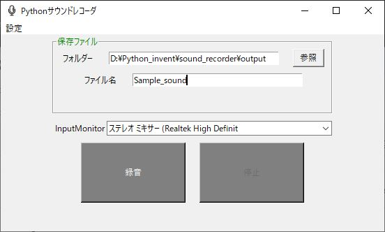

# sound_recorder1
Pythonで作成された。サウンドレコーダです。マイクにつないだ声だけではなく、ステレオミキサーも録音することもできます。
(必要追加ライブラリは PyAudioです。)

## 環境構築・実行
PyAudio をインストールしてください。 PyAudio をインストール後、このリポジトリ を Fork して git clone してください。
この.pyファイルの入っているPathに移動したら以下のコマンドを実行してください。

## 更新履歴
2022/01/12　ver 1.0.0公開
